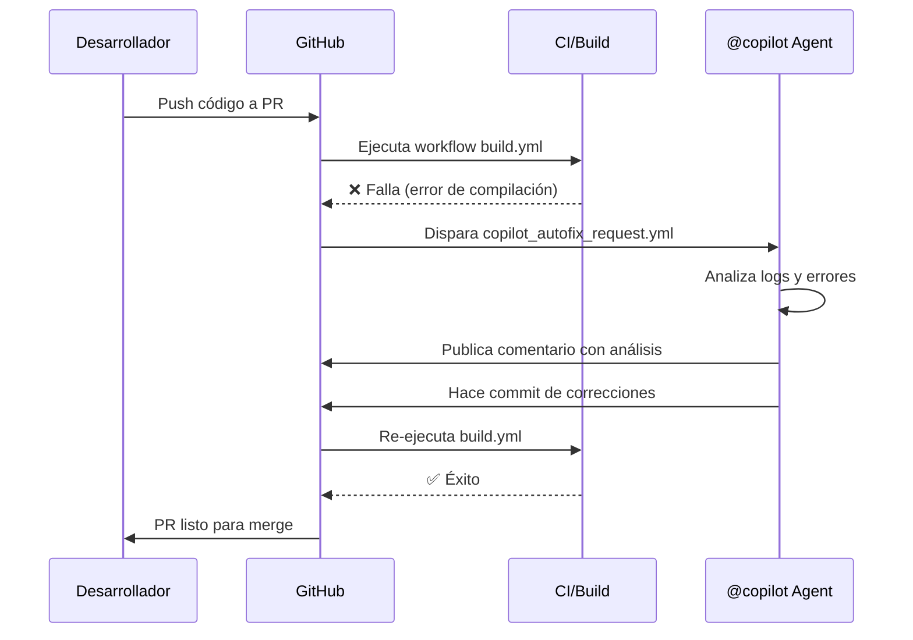

# 🤖 Guía de Uso: Cómo Llamar al Agente Copilot desde GitHub Actions

Esta guía explica cómo configurar y utilizar GitHub Copilot como agente automatizado que soluciona errores de CI en Pull Requests.

## 📋 Tabla de Contenidos

- [Descripción General](#descripción-general)
- [Configuración Inicial](#configuración-inicial)
- [Cómo Funciona](#cómo-funciona)
- [Requisitos](#requisitos)
- [Configuración Paso a Paso](#configuración-paso-a-paso)
- [Personalización](#personalización)
- [Solución de Problemas](#solución-de-problemas)
- [Mejores Prácticas](#mejores-prácticas)

---

## 🎯 Descripción General

El sistema automatizado permite:
1. **Detectar automáticamente** cuando falla el CI en un PR
2. **Invocar al agente Copilot** con contexto completo del error
3. **Recibir correcciones automáticas** directamente en el PR

### Flujo de Trabajo



---

## ⚙️ Configuración Inicial

### Requisitos

1. **Repositorio en GitHub** con GitHub Actions habilitado
2. **GitHub Copilot** habilitado para tu organización/cuenta
3. **Permisos configurados** correctamente en el repositorio

### Permisos Necesarios

El workflow necesita los siguientes permisos:

```yaml
permissions:
  actions: read          # Leer información de workflows y jobs
  pull-requests: write   # Comentar en PRs
  issues: write          # Crear comentarios (los PRs son issues)
  contents: read         # Leer contenido del repositorio
```

---

## 🔧 Configuración Paso a Paso

### Paso 1: Crear el Workflow de Build

Primero necesitas un workflow que ejecute tu CI/build. Ejemplo básico:

**`.github/workflows/build.yml`**

```yaml
name: Build  # ⚠️ Este nombre debe coincidir con el trigger del autofix

on:
  push:
    branches: [ main, develop ]
  pull_request:
    branches: [ main, develop ]

jobs:
  build:
    runs-on: ubuntu-latest
    
    steps:
    - uses: actions/checkout@v4
    
    - name: Install Dependencies
      run: |
        # Instala dependencias necesarias
        sudo apt-get update
        sudo apt-get install -y cmake ninja-build
    
    - name: Configure
      run: cmake -G "Ninja" -B build
    
    - name: Build
      run: cmake --build build
    
    - name: Test
      run: ctest --test-dir build --output-on-failure
```

### Paso 2: Crear el Workflow de Autofix

Crea el workflow que invocará a Copilot cuando Build falle:

**`.github/workflows/copilot_autofix_request.yml`**

```yaml
name: Copilot Autofix Request

on:
  workflow_run:
    workflows: ["Build"]  # ⚠️ Debe coincidir EXACTAMENTE con el nombre en build.yml
    types: [completed]

permissions:
  actions: read
  pull-requests: write
  issues: write
  contents: read

jobs:
  request-copilot-fix:
    runs-on: ubuntu-latest
    # Solo ejecuta si el workflow falló
    if: ${{ github.event.workflow_run.conclusion == 'failure' }}

    steps:
      - name: Post autofix request to PR(s)
        uses: actions/github-script@v7
        with:
          script: |
            const owner = context.repo.owner;
            const repo = context.repo.repo;
            const run = context.payload.workflow_run;
            const runId = run.id;
            const runUrl = run.html_url;

            // Obtener PRs asociados
            const prs = run.pull_requests || [];
            if (prs.length === 0) {
              core.info("No PRs associated. Exiting.");
              return;
            }

            // Obtener jobs fallidos
            const jobsResp = await github.rest.actions.listJobsForWorkflowRun({
              owner,
              repo,
              run_id: runId,
            });

            const failedJobs = jobsResp.data.jobs
              .filter(j => j.conclusion === "failure")
              .map(j => `- **${j.name}**: ${j.html_url}`);

            // Crear comentario para cada PR
            for (const pr of prs) {
              const body = `@copilot
              
              🔴 CI falló en ${runUrl}
              
              **Jobs fallidos:**
              ${failedJobs.join('\n')}
              
              Por favor:
              1. Analiza los logs
              2. Identifica la causa raíz
              3. Corrige el error
              4. Haz push a esta rama
              `;

              await github.rest.issues.createComment({
                owner,
                repo,
                issue_number: pr.number,
                body,
              });
            }
```

### Paso 3: Commit y Push

```bash
git add .github/workflows/
git commit -m "Add Copilot autofix workflow"
git push origin main
```

---

## 🎨 Personalización

### Cambiar el Mensaje a Copilot

Puedes personalizar las instrucciones que le das a Copilot:

```javascript
const body = `@copilot

🔴 **Build falló**: ${runUrl}

**Tu tarea:**
1. Revisa los errores en los logs de CI
2. Implementa la solución más simple
3. Asegúrate de que todos los tests pasen
4. Push los cambios a la rama \`${pr.head.ref}\`

**Jobs fallidos:**
${failedJobs.join('\n')}

**Reglas importantes:**
- No desactives tests ni checks
- Mantén el estilo de código existente
- Agrega comentarios si es necesario
- Actualiza documentación si aplica
`;
```

### Filtrar por Tipo de Falla

Solo invocar Copilot para ciertos tipos de errores:

```yaml
jobs:
  request-copilot-fix:
    runs-on: ubuntu-latest
    if: |
      github.event.workflow_run.conclusion == 'failure' &&
      contains(github.event.workflow_run.name, 'Build')
```

### Agregar Información de Contexto

Incluir más detalles en el mensaje:

```javascript
// Obtener archivos modificados en el PR
const filesResp = await github.rest.pulls.listFiles({
  owner,
  repo,
  pull_number: pr.number,
});

const modifiedFiles = filesResp.data
  .map(f => `- \`${f.filename}\` (+${f.additions}/-${f.deletions})`)
  .join('\n');

const body = `@copilot

**Archivos modificados en este PR:**
${modifiedFiles}

**Jobs fallidos:**
${failedJobs.join('\n')}

Por favor analiza y corrige.
`;
```

### Limitar a Branches Específicos

Solo activar en ciertos branches:

```javascript
if: |
  github.event.workflow_run.conclusion == 'failure' &&
  (github.event.workflow_run.head_branch == 'main' ||
   startsWith(github.event.workflow_run.head_branch, 'release/'))
```

---

## 🔍 Cómo Funciona

### 1. Workflow Build Falla

Cuando el workflow `build.yml` falla, GitHub emite un evento `workflow_run` con:
- `conclusion: failure`
- Lista de PRs asociados
- ID del workflow run

### 2. Se Dispara el Autofix Workflow

El workflow `copilot_autofix_request.yml` se ejecuta automáticamente:
- Verifica que la conclusión sea `failure`
- Obtiene la lista de PRs asociados
- Recopila información de los jobs fallidos

### 3. Se Publica el Comentario

Para cada PR asociado:
- Crea un comentario mencionando `@copilot`
- Incluye links directos a logs de CI
- Proporciona instrucciones claras

### 4. Copilot Responde

El agente Copilot:
1. Lee el comentario y el contexto del PR
2. Analiza los logs de CI
3. Identifica la causa raíz del error
4. Implementa una solución
5. Hace commit y push a la rama del PR

### 5. CI Se Re-ejecuta

El push automático de Copilot:
- Dispara el workflow `build.yml` nuevamente
- Si pasa, el PR está listo para merge
- Si falla, se puede invocar a Copilot nuevamente

---

## 🐛 Solución de Problemas

### El Workflow No Se Dispara

**Problema:** El workflow autofix no se ejecuta después de que Build falla.

**Solución:**
1. Verifica que el nombre del workflow coincida exactamente:
   ```yaml
   # build.yml
   name: Build  # <-- Este nombre
   
   # copilot_autofix_request.yml
   workflows: ["Build"]  # <-- Debe ser idéntico
   ```

2. Verifica los permisos en la configuración del repositorio:
   - Settings → Actions → General → Workflow permissions
   - Selecciona "Read and write permissions"

### Copilot No Responde

**Problema:** El comentario se publica pero Copilot no responde.

**Solución:**
1. Verifica que GitHub Copilot esté habilitado en tu organización
2. Asegúrate de mencionar `@copilot` (no `@github/copilot`)
3. Verifica que el mensaje sea claro y específico
4. Revisa si hay límites de tasa (rate limits) en la API

### Errores de Permisos

**Problema:** `Error: Resource not accessible by integration`

**Solución:**
```yaml
permissions:
  actions: read
  pull-requests: write  # Necesario para comentar
  issues: write        # Necesario para crear comentarios
  contents: read       # Necesario para leer el código
```

### Comentarios Duplicados

**Problema:** Se crean múltiples comentarios para el mismo fallo.

**Solución:** El código ya incluye protección contra duplicados:

```javascript
const marker = `<!-- copilot-autofix:${runId} -->`;

// Verificar si ya existe
const comments = await github.rest.issues.listComments({
  owner, repo, issue_number,
});

const already = comments.data.some(c => 
  (c.body || "").includes(marker)
);

if (already) {
  core.info("Comment already exists. Skipping.");
  continue;
}
```

---

## ✅ Mejores Prácticas

### 1. Mensajes Claros y Específicos

❌ **Mal:**
```javascript
const body = `@copilot Fix this`;
```

✅ **Bien:**
```javascript
const body = `@copilot

CI falló en el job de build con error de compilación.

**Error específico:** ${errorMessage}
**Archivo afectado:** ${fileName}

Por favor:
1. Analiza el error de compilación
2. Corrige la sintaxis o lógica
3. Asegúrate de que compila sin warnings
`;
```

### 2. Incluir Contexto Relevante

Proporciona toda la información que Copilot necesita:
- Links a logs específicos
- Archivos modificados
- Tipo de error (compilación, tests, lint)
- Entorno (OS, versiones de dependencias)

### 3. Establecer Expectativas Claras

Define qué debe hacer Copilot:
```javascript
**Requisitos:**
- ✅ Solución debe pasar todos los tests
- ✅ No introducir warnings nuevos
- ✅ Mantener cobertura de código
- ❌ No desactivar checks
```

### 4. Proteger Branches Importantes

```yaml
# Solo usar autofix en branches de desarrollo
if: |
  github.event.workflow_run.conclusion == 'failure' &&
  !contains(github.event.workflow_run.head_branch, 'main')
```

### 5. Revisar Cambios Automáticos

Siempre revisa los cambios que Copilot hace antes de hacer merge:
- Verifica que la solución sea correcta
- Asegúrate de que no rompe otras cosas
- Confirma que sigue las convenciones del proyecto

### 6. Logging y Monitoreo

Agrega logging para debugging:

```javascript
core.startGroup('Processing workflow run');
core.info(`Run ID: ${runId}`);
core.info(`Branch: ${headBranch}`);
core.info(`Failed jobs: ${failedJobs.length}`);
core.endGroup();
```

### 7. Límites de Tasa

Maneja rate limits de la API de GitHub:

```javascript
try {
  await github.rest.issues.createComment({
    owner, repo, issue_number, body,
  });
} catch (error) {
  if (error.status === 403 && error.message.includes('rate limit')) {
    core.warning('Rate limit exceeded. Will retry later.');
    // Implementar retry logic
  } else {
    throw error;
  }
}
```

---

## 📚 Recursos Adicionales

- [GitHub Actions Documentation](https://docs.github.com/en/actions)
- [GitHub Copilot Documentation](https://docs.github.com/en/copilot)
- [workflow_run Event](https://docs.github.com/en/actions/using-workflows/events-that-trigger-workflows#workflow_run)
- [actions/github-script](https://github.com/actions/github-script)
- [GitHub REST API](https://docs.github.com/en/rest)

---

## 🤝 Soporte y Contribuciones

¿Encontraste un problema o tienes una mejora?

1. Abre un [issue](../../issues/new) con detalles
2. Proporciona logs del workflow
3. Describe el comportamiento esperado vs actual

---

## 📝 Changelog

### v2.0 - Mejoras de Robustez
- ✅ Mejor manejo de errores
- ✅ Logging más detallado
- ✅ Información adicional del PR
- ✅ Instrucciones expandibles
- ✅ Protección contra comentarios duplicados mejorada

### v1.0 - Release Inicial
- ✅ Detección automática de fallos
- ✅ Invocación de Copilot
- ✅ Links a logs de CI

---

## 🎓 Ejemplo Completo

Aquí tienes un ejemplo completo y funcional listo para usar:

<details>
<summary>Ver código completo</summary>

**`.github/workflows/copilot_autofix_request.yml`**

```yaml
name: Copilot Autofix Request

on:
  workflow_run:
    workflows: ["Build"]
    types: [completed]

permissions:
  actions: read
  pull-requests: write
  issues: write
  contents: read

jobs:
  request-copilot-fix:
    runs-on: ubuntu-latest
    if: ${{ github.event.workflow_run.conclusion == 'failure' }}

    steps:
      - name: Post autofix request to PR(s)
        uses: actions/github-script@v7
        with:
          script: |
            const owner = context.repo.owner;
            const repo  = context.repo.repo;
            const run = context.payload.workflow_run;
            const runId = run.id;
            const runUrl = run.html_url;
            const headBranch = run.head_branch;
            const headSha = run.head_sha;

            core.info(`Processing run ${runId} for ${headBranch}`);

            const prs = run.pull_requests || [];
            if (prs.length === 0) {
              core.info("No PRs found. Exiting.");
              return;
            }

            const jobsResp = await github.rest.actions.listJobsForWorkflowRun({
              owner, repo, run_id: runId, per_page: 100,
            });

            const failedJobs = jobsResp.data.jobs
              .filter(j => j.conclusion === "failure")
              .map(j => `- **${j.name}** — [Ver logs](${j.html_url})`);

            const marker = `<!-- copilot-autofix:${runId} -->`;

            for (const pr of prs) {
              const comments = await github.rest.issues.listComments({
                owner, repo, issue_number: pr.number, per_page: 100,
              });

              if (comments.data.some(c => c.body?.includes(marker))) {
                core.info(`Skipping PR #${pr.number} - already commented`);
                continue;
              }

              const body = `${marker}
@copilot

🔴 **CI falló** en [${run.name}](${runUrl})

**Jobs fallidos:**
${failedJobs.join('\n')}

**Por favor:**
1. Analiza los logs de CI
2. Identifica y corrige la causa raíz
3. Push los cambios a \`${headBranch}\`

**Reglas:**
- Mantén cambios mínimos
- No desactives checks
- Asegura que pasen todos los tests
              `;

              await github.rest.issues.createComment({
                owner, repo, issue_number: pr.number, body,
              });

              core.info(`✅ Posted to PR #${pr.number}`);
            }
```

</details>

---

¡Listo! Con esta configuración, cada vez que tu CI falle, Copilot será invocado automáticamente para ayudar a resolver el problema. 🚀
